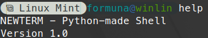
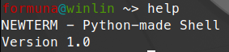

# NewTerm

NewTerm is a shell - like **Bash**, **FISH** and **ZSH** - but made completely with Python.

NewTerm is NOT made to replace any shells, only to be put ontop of.

> Note: NewTerm is a silly little project so don't expect anything too big.

If you use a NerdFonts-patched font (available here: [https://www.nerdfonts.com/#home](https://www.nerdfonts.com/#home)) you can set a variable in the code to make use of special characters.

How NewTerm looks with a NerdFont:

How NewTerm looks with**out** a NerdFont:

Yes, the NerdFont-using theme IS inspired by Powerlevel10k.

## Usage

There are 2 ways to downloading and using NewTerm.

### 1. From Releases tab (reccommended)

The latest version of NewTerm is available in the Releases tab [here](https://github.com/FormunaGit/NewTerm/releases/).

### 2. Directly from the branch

You can download the file directly from the `master` branch, since the file is [here](https://github.com/FormunaGit/NewTerm/blob/main/newterm.py). You can download it, copy the code and put it into a Python file, you can clone it, and some other strange way.

After that, just run `newterm.py` in a terminal and voila!
